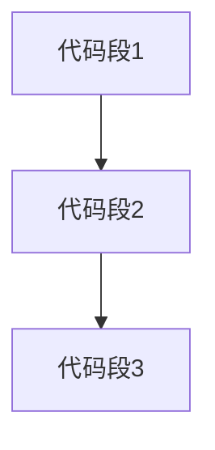
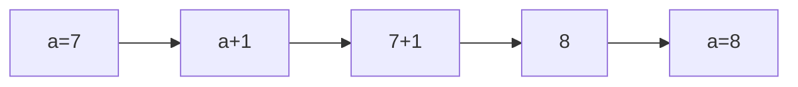

###### C++竞赛入门教程<br>`#文档密级|内部公开#(orange)`<br><br><br><br><br><br>**陈名赫**<br>*C++编程社团*

[TOC]

# 认识C++

## C++基本结构

以下是 C++的基本结构，是我们以后编写程序所必须的一个框架。代码如下：

```c++
#include <iostream>
using namespace std;
int main()
{
    return 0;
}
```

我们暂时不需要知道这个框架是什么意思，只需知道每个程序都需要加上这个框架。

需要注意的是，第一行代码`#include <iostream>`后面是并没有分号的，说明它不是C++的语句；后面的`int main()`以及`{`、`}`后面都没有分号。另外，在两个花括号里括起来的内容是要进行缩进（4 个空格）的，养成良好的编程习惯是非常重要。

## 输出`Hello, world! `

我们可以使用以下语句放入基本结构中，让计算机在屏幕上打印一句`Hello, world! `，代码如下：
```c++
#include <iostream>
using namespace std;
int main()
{
    cout<<"Hello, world! "<<endl;
    return 0;
}
```

说明：

* `cout` 是输出语句。

* `<< `与`cout` 配合使用。

* `"Hello, world! "`是一个字符串，可简单理解如下：`""`里的内容原样输出。

*  `endl`起到换行的作用，即“end-of-line”。

* 特别注意末尾的分号，它是 C++语句的结束标记，可以类比成中文的句号。

## 编译、运行

编辑好一个程序后，可以让计算机按照这个指令去执行。但是，计算机本质上只认识由0和1组成的二进制序列（机器码），因此，需要先将 C++代码“翻译”成机器码，这个过程叫`编译`，由自行安装的编译器或者集成开发环境自带的编译器来完成。在编译的时候，会完成诸如“语法检查”之类的工作，如果程序“不合法”，会报错。编程并非将“任务”从自然语言直译成 C++代码，而是需要遵循 C++的一些语法规则，这也是我们要学习的重点。

完成编辑`Hello, world! `程序后，“编译”、“运行”，或直接“编译运行”，即可在弹出的“控制台程序”窗口中观察到程序运行的结果。

注意：编译时会提示源代码的保存，需要养成文件命名的习惯。在信息学竞赛中，我们需要将源代码命名成指定的名字，保存在指定的位置。

运行结果如下：

```
Hello, world! 

```

## 字符串常量

所谓常量，是指在程序运行过程不变的量。`""`里的内容原样输出，是常量的一种，我们称它为“字符串常量”。字符串常量可以是中文，例如：

```cpp
#include <iostream>
using namespace std;
int main()
{
    cout<<"学生：我不想期末考试！ "<<endl;
    cout<<"老师: 我想放假！"<<endl;
    return 0;
}
```

## 小试身手

详见洛谷团队题目[T306001 ](https://www.luogu.com.cn/problem/T306001)[T306003](https://www.luogu.com.cn/problem/T306003)

## 算术运算符

分析下面程序的运行结果，示例：

```c++
cout<<"3+5"<<endl;
cout<<3+5<<endl;
```

从运行结果可以看出，双引号里的内容原样输出，没有双引号的话直接计算结果。

因此，我们可以编写程序来实现四则运算。在 C++中，有一类运算符可以实现我们所熟悉的简单四则运算，称之为算术运算符。

常用的算术运算符如下：

* `+`：加法
* `-`：减法
* `*`：乘法
* `/` ：除法
* `%`：求模（求余数）
  需要注意的是`/`，当两边都是整数的时候，结果自动取整。例如：

```cpp
#include <iostream>
using namespace std;
int main()
{
    cout<<3+2<<endl;
    cout<<3-2<<endl;
    cout<<3*2<<endl;
    cout<<3/2<<end1;
    cout<<3%2<<endl;
    return 0;
}
```

  运行结果为:

  ```
  5
  1
  6
  1
  1

  ```

## `cout`的一般形式

`cout `是C++的输出语句，`cout `语句的一般格式：

```c++
// 形式1:一个输出语句中只插入一个项目
cout<<项目1;
cout<<项目2;


// 形式2:一个输出语句中插入多个项目
cout<<项目 3<<项目 4<<...<<项目n;
```

说明：

* 如果项目是表达式，则输出表达式的值。

* 如果项目`''`或`""`，则输出引号内的内容。

* `//`代表注释，从它到这一行的行末都属于注释，注释不会被执行。

> C++的输出和输入是用“流”的方式实现的。在定义流对象时，系统会在内存中开辟一段缓冲区，用来暂存输入输出流的数据。在执行 `cout `语句时，先把数据存放在输出缓冲区中，直到输出缓冲区满或遇到 `endl` 或`'\n'`为止，此时缓冲区已有的数据一起输出，并清空缓冲区。

## 概念小结

- 程序：为实现特定目标或解决特定问题而用计算机语言编写的一系列指定序列。
- 语言：人与计算机之间通信的语言；种类很多，如BASIC、PASCAL、JVAV等，每种语言都有自身所定义的规则；即使同一种语言也有不同的版本，内部规则也会有少许不同。
- 编程：为了解决一些特定问题，在遵循特定的计算机语言规则下编写程序的过程。
- 编辑：在某种计算机语言环境下编写程序的过程。
- 翻译：对所编写的程序进行解析的过程（类比：文字只是符号图案，需体会含义）。
- 解释：计算机对程序指令翻译一句执行一句；BASIC、JVAV等属于解释型语言。
- 编译：计算机对程序的全部指令一次性全部翻译后，再让计算机执行；PASCAL、C++都属于编译型语言。

# 顺序结构

我们来学习顺序结构程序设计，其基本思路是：把需要计算机完成的工作分成若干个步骤，然后依次让计算机执行。



计算机的“本职工作”是计算，因此先从算术运算入手。

运行下面的代码，总结除号`/`的规律。

```c++
#include <iostream>
using namespace std;
int main()
{
    cout<<3/2<<endl;
	cout<<3.0/2<<endl;
	cout<<3/2.0<<endl;
	cout<<3.0/2.0<<endl;
	return 0;
}
```

运行结果:

```
1
1.5
1.5
1.5

```

分析运行结果，我们可以简单得出这样的结论：

- 对计算机而言，`3` 和 `3.0` 是两种不同类型的数据；整型数据和浮点型数据。

- `/`一号两用，两边是整数时结果取整，是整除；两边存在实数时，是实除。

在 C++中，数字被明确地分成了两类：不带小数点的和带小数点的。前一种就是我们常说的整数，后一种在技术上叫浮点数。C++在做每一步数学运算的时候，会尽量保持计算结果的精确性,于是就有了下面的规则：

1. 两个整数做运算，结果为整数；
2. 两个浮点数做运算，结果是浮点数；
3. 一个整数和一个浮点数做运算，为保持结果的精确，C++会把那个整数自动转换为浮点数，然后使用规则2，最终得到浮点数结果。

这种运算规则在多数情况下都是符合我们的意愿的。但偶尔也会有意外，问题就出在除法运算上：当两个整数做除法时，C++进行“整除运算”：即 `6/3` 的结果是`2`（这是当然的啦），而`8/3` 的结果仍然是`2`！不理会小数部分，切断取整，没有四舍五入！而当两个浮点数做除法时，C++进行“除法运算”，才能够得到浮点数的解。

至此，我们已经会用 C++处理很多计算题了，但有一个问题不知你发现没有： 所有我们写过的程序，一旦数据发生了变化，我们就得修改我们的代码并重新编译、运行它来得到结果。虽然我们得到了可执行文件，但我们的程序无法脱离开发环境，如果其他人没有学过C++，或者没有学过怎么使用我们的开发环境，就不能用我们的程序来处理其它数据——这样的程序其实是没有任何实用性可言的。

以下的内容，就是要教会你如何来解决这个问题。

## 常量和变量
- 常量：顾名思义，常量就是不变的量。
- 变量：在内存中保存数据的地方，而其中的数据是可以随时修改的。
- 变量名：变量的名字，用来标识变量。
- 变量名的命名规则：以字母或下划线开头的字母、数字、下划线组合。在 C++中，变量名是区分大小写的；此外，**系统关键字（保留字）** 不能用作变量名。

可以说，变量由两部分组成：变量名 + 变量值


## C++基本数据类型

常见的C++数据类型：

**关键字**|描述|字节|表示范围
-|-|-|-
`char`|字符型|1字节|有符号数：`-128` to `127`<br>无符号数：`0` to `255`
`short int`|短整型|2字节|有符号数：`-32768`to`32767`<br>无符号数：`0`to`255`
`int`|整型|4字节|有符号数：`-2147483648` to `2147483647`<br>无符号数：`0`to`4294967295`
`bool`|布尔型|1字节|`true` or `false`
`float`|浮点型|4字节|`3.4e +/- 38 `(`7` digits)
`double`|双精度浮点型|8字节|`1.7e +/- 308 `(`15` digits)
`long long`|表示最大的整数类型|8字节|
`unsigned int`|表示无符号整数|4字节|`0`to`4294967295`

C++程序中的变量在使用前必须定义，定义方法为：**数据类型名** **变量名**;

例如：

```cpp
int a;				// 代表定义1个整数类型的变量
double b,c,d;		// 代表定义3个实数类型的变量
char x;				// 代表定义1个字符类型的变量
bool t;				// 代表定义1个布尔类型的变量
......
```
## C++算术运算符和赋值运算符

* **算术运算符**
  `+`（加法）、`-`（减法）、`*`（乘法）、`/ `（除法）、`%`（求模）
* **赋值运算符**：

  `=`

## C++输入输出语句
* 输入语句：`cin`
   ```cpp
   cin>>变量;
   ```
  例如：

  ```cpp
  cin>>a;
  cin>>b;
  ```

  或

  ```c++
  cin>>a>>b
  ```

  代表输入数据存入变量`a`和`b`。

* 输出语句：`cout`

  ```cpp
  cout<<变量或常量;
  ```

  例如：

  ```
  cout<<"Hello, world! "<<endl;
  cout<<"he="<<he<<endl;
  cout<<a<<endl;
  ……
  ```

## 程序试验

**例 1：未初赋值的变量，其值是不确定的**

```c++
int a;
cout<a<<endl;
```

**例 2：赋值的方法（赋值运算符、输入)**

```c++
int a;			// 初始化:int a=3;	 或	 int a,b=3;
cin>>a;			// 赋值语句:a=3;	或	a=b;	或	a=b+4;
cout<<a<<endl;
```

**例 3：多次赋值给同一个变量，变量的值取决于最后一次的赋值**

```c++
a=1; a=2;
```

**例 4：定义变量、赋值时要注意数据类型**

```c++
int a;
a=3.5;
cout<<a<<endl;
```

结果为`3`，这属于自动类型转换。

**例5：同一个变量在赋值前后的变化**

```
int a=7;
a=a+1;
cout<<a<<endl;
```

结果为 `6`，分析过程：



结论:更加体现出变量的特点，是存储空间；变量名不变，但里面的值可以发生改变。

**例 6：计算两个整数的和、差、积、商**

```c++
int a,b,he,cha,ji;
cin>>a>>b;
he=a+b;
cha=a-b;
ji=a*b;
cout<<he<<" "<<cha<<" "<<ji<<endl;
```

**例 7：强制类型转换:计算两个整数的商(实除)和求余的结果**

```c++
int a,b,zc,yu;
double shang;
cin>>a>>b;
zc=a/b;
yu=a%b;				// 要求 a和b 必须是整数
shang=(double)a/b;
cout<<zc<<" "<<yu<<" "<<shang<<endl;
```

## 小试身手

详见洛谷团队题目[T306816](https://www.luogu.com.cn/problem/T306816) [T306831](https://www.luogu.com.cn/problem/T306831) [T306894](https://www.luogu.com.cn/problem/T306894) 

# 选择结构

根据不同的状态来决定接下来应该做哪些事情，我们称之为分支结构，也叫选择结构。

## 关系运算符
选择结构丰富了我们处理问题的方法，使得计算机能够解决更多的问题了。

在此之前，我们需要先说明一下在计算机中用来判断两个数的关系的符号，即关系运算符，一共有如下6个:

<table>
<tr>    
	<td>></td>
    <td>大于</td>
    <td>判断前一个表达式的结果是否大于后一个表达式的结果</td>
</tr>
<tr>
	<td>>=</td>
	<td>大于等于</td>
	<td>判断前一个表达式的结果是否大于等于后一个表达式的结果</td>
</tr>
<tr>
    <td><</td>
    <td>小于</td>
    <td>判断前一个表达式的结果是否小于后一个表达式的结果</td>
</tr>
<tr>
    <td><=</td>
    <td>小于等于</td>
    <td>判断前一个表达式的结果是否小于等于后一个表达式的结果</td>
</tr>
<tr>
    <td>=&zwnj;=</td>
    <td>等于</td>
    <td>判断前一个表达式的结果是否等于后一个表达式的结果</td>
</tr>
<tr>
    <td>!=</td>
    <td>不等于</td>
    <td>判断前一个表达式的结果是否不等于后一个表达式的结果</td>
</tr>
</table>

需要特别注意的是，在 C++中，一个等于号`=`表示赋值，两个等于号`==`表示判断左右的表达式的结果是否相等。

另外，C++中只提供了这6个关系运算符，像`=>`都是不存在的。

>例如，以下写法是正确的:  
`5>=4`  
`7!=8 ` 
`a<b`  
`c==d`

>以下写法是错误的:  
`4=<7`  
`8=>3`  

思考:让计算机判断一个整数是否为正整数，如果是则显示 yes，不是则什么都不显示,应该怎么办呢?

* 首先，我们需要定义一个变量来存储这个整数。  
* 然后，我们需要告诉计算机这个数是什么。
* 接下来，计算机需要判断这个数是否为正数。  
* 最后，将计算机判断的结果输出在屏幕上。  

这就是解决这个问题的**算法**。我们每遇到一个问题，首先需要思考的就是解决这个问题的算法，也就是解决这个问题的方法和步骤。

那么，如何判断这个数是否为正数呢? 我们需要用到C++中的 `if` 语句。
## if 语句
### if型
```cpp
if (条件表达式)
{
    语句组;
}
```
功能:如果条件成立，那么执行语句组。否则，什么都不做。条件表达式通常由算术运算符、关系运算符、逻辑运算符等构成，结果具有二值性。


**例1:判断一个数是否为正数，如果是正数则显示 yes，不是则什么都不显示**

完整代码如下:
```cpp
#include<iostream>
using namespace std;
int main()
{
    int x;
    cin>>x;
    if(x>0)
    {
        cout<<"yes"<<endl;
    }
    return 0;
}
```

**例 2:假设某市的出租车计费方案如下:如果行驶3 公里以内(含)，那么费用为 14元，如果超过3公里，超过的部分每公里另外收取 2.3 元。**

输入出租的行驶公里数，计算应付的费用。核心代码如下:
```cpp
int gl;
double rmb;
cin>>gl;
if(gl<=3) 
{
    rmb=15;
}
if(gl>3)
{
    rmb=15+(gl-3)*1.5;
}
cout<<rmb<<endl;
```
或者在 if 语句里完成输出:
```cpp
if(gl<=3)
{
    rmb=15;
    cout<<rmb<<end1;
}
if(gl>3)
{
    rmb=15+(gl-3)*1,5;
    cout<<rmb<<end1;
}
```
注意:条件设定应不重不漏，否则会出错。

### if else型
```cpp
if(条件)
{
    语句组 1;
}
else
{
    语句组 2;
}
```
功能:如果条件成立，那么执行语句组1，否则执行语句组 2。

注意:以上两种结构，如果语句组仅为1条时，可以省略`{ }`。

条件表达式通常由算术运算符、关系运算符、逻辑运算符等构成，结果具有二值性。


因此，出租车计价方案的程序可以修改如下:
```cpp
#include <iostream>
using namespace std;
int main()
{
    double gl,f;
    cin>>gl;
    if(g1<=3) 
    {
        f=14;
    }
    else
    {
        f=14+(gl-3)*2.3;
    }
    cout<<f<<endl;
    return 0;
}
```
`if-else`不会出现条件重叠的情况，较之两个`if` 语句的实现更能保证正确性。


**小试身手1**：见洛谷团队题目

## 选择结构的嵌套
`if`与`if-else`型可以相互套，这种套并没有固定的模式。

**例 3:输入三条边的长度，判读这 3 条边是否可以构成三角形**

>输入:3 5 4  
输出:Yes    
输入:2 4 1  
输出:No  

分析：3个正整数构成三角形的条件为“任意两边之和大于第三边”，即需要满足3个子条件：`a+b>c`、`a+c>b`、`b+c>a`。因此，可利用选择结构的嵌套来实现。

*示例 1:可以模仿游戏闯关的思路，闯过第一关后再闯第二关，闯过第二关后再闯第三关......只有闯过所有关卡才算成功。*

```cpp
#include<iostream>
using namespace std;
int main()
{
    int a,b,c;
    cin>>a>>b>>c;
    if(a+b>c)           // 第一关
    {
        if(a+c>b)       // 第二关
        {
            if(b+c>a)   // 第三关
                cout<<"Yes"<<endl;
            else
                cout<<"No"<<endl;
        }
        else
            cout<<"No"<<endl;
    }
    else
        cout<<"No"<<endl;
    return 0;
}
```

*示例 2:也可以从“不成立”的角度来考虑*

```cpp
#include<iostream>
using namespace std;
int main()
{
    int a,b,c;
    cin>>a>>b>>c;
    if(a+b<=c)
        cout<<"No"<<endl;
    else
    {
        if(a+c<=b)
            cout<<"No"<<endl;
        else
        {
            if(b+c<=a)
                cout<<"No"<<endl;
            else
                cout<<"Yes"<<endl;
        }
    }
    return 0;
}
```

以上这两种写法都可以实现三角形的判断问题。选择结构的嵌套比较锻炼逻辑思维问题，但当子条件数量过多的时候，嵌套会带来难度，而且效率不高。在更多的时候，我们可以使用逻辑运算符来解决，效率更高，结构更清晰。

## 逻辑运算符
所谓逻辑运算，就是指把若干个条件通过逻辑运算符连接起来，共同形成一个更复杂条件的运算。C++共支持三种逻辑运算符，如下表所示:

逻辑运算符名称|名称|意义|举例|说明
------------|----|---|----|----
&&|逻辑与|所有用&&连接起来的条件必须同时成立，整个条件才成立。|a>5 &&b>10|只有a>5、b>10同时成立，整个条件才成立。可以把&&理解为“并且”可以用&&连接任意多个条件。
&#124;&#124;|逻辑或|所有用&#124;&#124;连接起来的条件，只要其中有一个成立，整个条件就成立。|a>5&#124;&#124;b>10|只要a>5、b>10成立一条，整个条件就被认为“成立”。可以把 &#124;&#124;理解为“或者”；可以用&#124;&#124;连接任意多个条件。
！|逻辑非|将之后的条件成立与否变成相反的一一成立的条件变成不成立的，不成立的条件变成成立的。|!(a>b)|如果 a>b，则整个条件是不成立的:如果 a>b 不成立则整个条件是成立的。可以把！理解为“不......":！不是用来“连接”条件的，它只对后面的一个条件起作用。

根据上面的分析，可以形成三角形的条件我们可以写成:  
`a+b>c && a+c>b && b+c>a`

那么，“不能”形成三角形的条件我们就可以写成:  
`!(a+b>c && a+c>b && b+c>a)`

因此，可以用逻辑运算符来求解**例3**，代码如下:
```cpp
#include<iostream>
using namespace std;
int main()
{
    int a,b,c;
    cin>>a>>b>>c;
    if(a+b>c && a+c>b && b+c>a)
        cout<<"Yes"<<endl;
    else
        cout<<"No"<<endl;
    return 0;
}
```
或
```cpp
#include<iostream>
using namespace std;
int main()
{
    int a,b,c;
    cin>>a>>b>>c;
    if(!(a+b>c && a+c>b && b+c>a))
    // 等价于if(a+b<=c || a+c<=b || b+c<=a)
        cout<<"No"<<endl;
    else
        cout<<"Yes"<<endl;
    return 0;
}
```
这里，不知道你有没有担心过表达式 `a+b>c && a+c>b && b+c>a` 的运算顺序呢?
很多时候，为了确保运算顺序如我们所预期的进行，需要像数学运算那样添加一些括号（括号里的优先算）。不同的是，数学中会使用小括号、中括号、大括号来逐级限制顺序，而 C++中只能使用小括号来限制运算顺序，不管需要括多少层，都只能使用小括号（因为中括号大括号已被定义成了其它用途）。

然而，在表达式`a+b>c && a+c>b && b+c>a` 中，我们并没有添加小括号，但它最终的结果也是符合我们预期的,说明这个表达式中运算符的运算顺序就如同我们所希望的顺序执行的，这就是运算符的优先级。

目前，我们学习了 C++中的一部分运算符，其中算术运算符、关系运算符和逻辑运算符的优先级如下:  
`   逻辑非! >   算术运算符  >   关系运算符  >   逻辑与、逻辑或  `

当然，同一类运算符中还可以再细分优先级。例如，算术运算符中的乘`*`、除`/`运算符的优先级是高于加`+`、减`-`运算符的。

# 多分支结构

在上一章中，举例说明了`if`与`if-else`的嵌套形式，实际上处理的就是多分支结构。这一章，我们来认识下一种特殊嵌套形式：`else-if`型，更便于处理多分支的问题。另外，在C++中，还有一种开关多分支结构，由`switch`语句来实现。

## else-if型
else-if 型适用于大于等于 3 分支情况，其一般形式如下:
```cpp
if(条件1)
    语句1;
else if(条件2)
    语句2;
...
else if(条件n)
    语句n;
else
    语句n+1;
```


**例4: 输入一个正整数，判断该数是正数、负数、还是0?**

核心代码如下:
```cpp
int x;
cin>>x;
if (x>0)
    cout << "x is positive" << endl;
else if (x <0)
    cout << "x is negative" << endl;
else
    cout <<"x is 0"<< endl;
```
## switch语句
if 语句是在两者之间作出抉择，而 switch 语句(又称开关语句，也称 switch-case语句)是在多种情况中作出选择，它是一种多路径分支控制语句。在执行多路径分支控制时用switch 语句写出的程序比用 if 语句写的程序更简洁、清晰，且不易出错。

switch 语句的一般形式如下:
```cpp
switch(表达式)
{
    case    常量表达式1;    语句1;  break;
    case    常量表达式2;    语句2;  break;
    ......
    case    常量表达式n;    语句n;  break;
    default:    语句n+1; // default 缺省、默认;整体可以省略不用
}
```
switch 语句的执行过程:  
先计算表达式的值，并逐个与其后的常量表达式值相比较:当表达式的值与某个常量表达式的值相等时，即执行其后的语句。执行完该语句后，不再进行判断，继续执行后面所有case后的语句，只有当遇到 break 语句或执行完全部switch 语句时才跳出。

如果表达式的值与所有 case 后的常量表达式均不相同时,则执行 default 后的语句default 语句是可选的，表示以上条件都不满足的情况。

>注意: break 语句能用于跳出 switch 语句，也能用于跳出后面讲次中会出现的 for语句、while语句，但不能用于跳出 if 语句。例如:
```cpp
if(1)
{
    break;
}
```
>会出现语法错误。

## 条件运算符
C++中还有一个很特殊的运算符一一条件运算符，可以用来实现类似于 if-else 的功能，非常得神奇。

条件运算符要求有 3个操作对象，称三目 (元）运算符，它是C/C++语言中唯一的一个三目运算符。条件表达式的一般形式为:  
`表达式1?表达式2:表达式3`

条件运算符的作用方式可以看成一个 if-else 语句，其执行过程为:  
先求解表达式1，若为真(非0)则求解表达式2，此时表达式2的值就作为整个条件表达式的值;若表达式1的值为假(0)，则求解表达式 3，将表达式3的值作为整个条件表达式的值。例如:  
`c=(a>b)?a:b;`

执行结果就是将表达式的值赋给 c，也就是将 a和b二者中大者赋给 c。